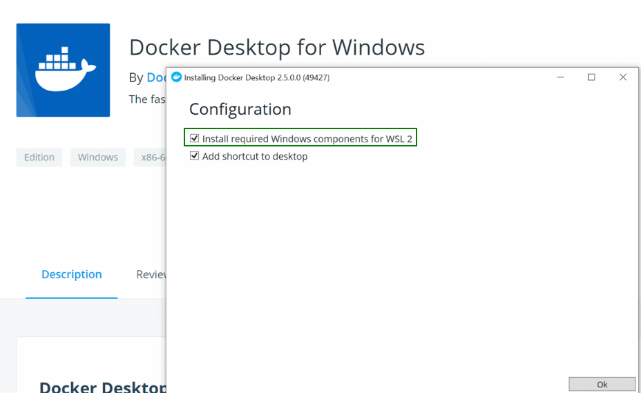

# Hadoop-Hive-Spark cluster on Docker

## Prerequisites

- Docker Desktop
    Docker Desktop is the easiest way to get started with Docker on Windows. It includes both Docker and Docker Compose, and works seamlessly with Windows Subsystem for Linux (WSL 2).

- Step 1: Enable WSL 2 (If Not Already Enabled)
Docker Desktop requires WSL 2 (Windows Subsystem for Linux version 2) for optimal performance. If WSL 2 isn’t enabled on your system, follow these steps to set it up:
    
    1-Open PowerShell as Administrator.
    
    2-Run the following commands to install WSL:
    ```
    wsl --install
    wsl --update
    ```
    3- Set WSL 2 as default

    ```
    wsl --set-default-version 2
    ```

- Step 2: Download Docker Desktop for Windows

    1-Visit the [Docker Desktop download page](https://www.docker.com/products/docker-desktop/).
    
    2-Choose the version compatible with your system (Windows 10/11 Pro or Enterprise with WSL 2 enabled is recommended). If you’re not sure whether your system is compatible, Docker will notify you during the installation if it’s not.
- Step 3: Install Docker Desktop
After the download finishes, open the installer file.
Follow the on-screen instructions in the installation wizard.
During installation, ensure you select the option to enable WSL 2 instead of Hyper-V. This option allows Docker to run in a lightweight Linux-based virtual machine, which is more efficient than Hyper-V for most use cases.

    <p align="center">
      
    </p>

    Once the installation completes, restart your system if prompted.


## Software

* [Hadoop 3.3.6](https://hadoop.apache.org/)

* [Hive 3.1.3](http://hive.apache.org/)

* [Spark 3.5.3](https://spark.apache.org/)

## Quick Start

After docker installation, to deploy the cluster, run following commands in your terminal:

Create a new folder in your desktop and open git bash here then clone repo
```
git clone https://github.com/muhammetbektas/hadoop-hive-spark-docker.git
```
Then change your working directory and move to ../hadoop-hive-spark-docker
```
.\make.bat
docker-compose -f docker-compose.yml up
```

## Access interfaces with the following URL

### Hadoop

ResourceManager: http://localhost:8088

NameNode: http://localhost:9870

HistoryServer: http://localhost:19888

Datanode1: http://localhost:9864
Datanode2: http://localhost:9865


### Spark
master: http://localhost:8080

worker1: http://localhost:8081
worker2: http://localhost:8082

history: http://localhost:18080

### Hive
URI: jdbc:hive2://localhost:10000